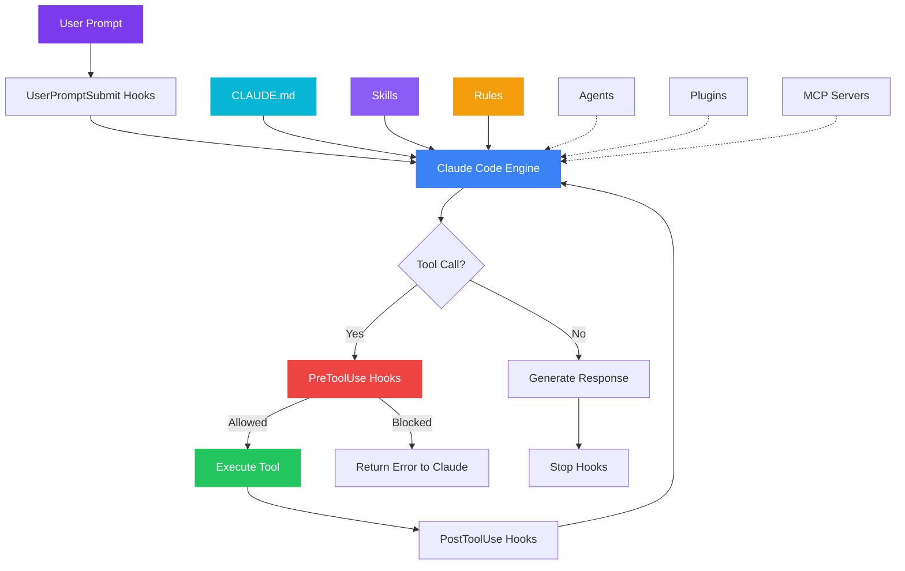

<div align="center">

<!-- HERO -->
<br>


<br>

# Claudin

**From zero to productive in minutes.**<br>
The complete scaffold for professional Claude Code environments.

<br>

[](LICENSE)
[](https://acn3to.github.io/claudin)
[](https://github.com/acn3to/claudin/pulls)
[](https://docs.anthropic.com/en/docs/claude-code)

<br>

[**Getting Started**](#-getting-started) · [**Features**](#-features) · [**Profiles**](#-project-profiles) · [**Documentation**](https://acn3to.github.io/claudin) · [**Contributing**](#-contributing)

<br>

---

</div>

<br>

## The Problem

Setting up Claude Code properly for a project means configuring **skills, hooks, agents, rules, permissions, plugins, MCP servers, status line, keybindings, CI/CD**, and more. Each feature has its own syntax, file location, and best practices scattered across documentation.

**Claudin solves this.** One command gives you a production-ready Claude Code environment with security hardening, cost optimization, and team conventions — all pre-configured.

<br>

## ✨ Features

<table>
<tr>
<td width="50%">

### 🛡️ Security by Default
Hooks that **block secret exposure**, audit every file change, and protect credentials. Permissions deny dangerous commands like `git push --force` and `rm -rf /`.

</td>
<td width="50%">

### 💰 Cost Optimization
Smart **model selection strategies** — Sonnet for daily work (60% savings), Haiku for subagents (85-92% savings). Real-time cost tracking in the status bar.

</td>
</tr>
<tr>
<td width="50%">

### 🤖 Custom Agents
Pre-built **code reviewer**, **documenter**, and **architecture reviewer** agents. Each with scoped permissions and focused capabilities.

</td>
<td width="50%">

### 📐 Architecture Rules
**Clean architecture** validation, coding standards, and refactoring skills. Auto-loaded rules that enforce conventions without manual prompting.

</td>
</tr>
<tr>
<td width="50%">

### ⚡ Context Optimization
`.claudeignore` template excluding **60+ file patterns**, saving 30k-100k tokens per session. Context re-injection hooks preserve critical information.

</td>
<td width="50%">

### 🔄 CI/CD Ready
**GitHub Actions** workflow template with `claude-code-action` for automated PR reviews, headless mode for pipelines, and Agent SDK integration.

</td>
</tr>
</table>

<br>

## 🚀 Getting Started

### Interactive Installer (Recommended)

```bash
git clone https://github.com/acn3to/claudin.git
cd claudin && bash scripts/setup.sh /path/to/your-project
```

The installer will guide you through profile selection, configuration, and optional global setup.

### Manual Setup

```bash
# Copy the template to your project
cp -r template/.claude /path/to/your-project/
cp template/CLAUDE.md template/.claudeignore /path/to/your-project/

# Make hooks executable
chmod +x /path/to/your-project/.claude/hooks/*.sh
```

### Global Config Only

Want the status line and keybindings without a project scaffold?

```bash
cp global/statusline.sh global/keybindings.json ~/.claude/
chmod +x ~/.claude/statusline.sh
```

<br>

## 📦 What's Inside

```
claudin/
├── template/                 # Drop-in scaffold for any project
│   ├── .claude/
│   │   ├── settings.json     # Permissions & hook registration
│   │   ├── hooks/            # File protection, audit log, context re-injection
│   │   ├── skills/           # Starter skill + clean architecture refactoring
│   │   ├── agents/           # Code reviewer, documenter, architecture reviewer
│   │   └── rules/            # Code standards, clean architecture patterns
│   ├── .github/workflows/    # CI/CD with claude-code-action
│   ├── .claudeignore         # 60+ universal file exclusions
│   └── CLAUDE.md             # Customizable project instructions
│
├── profiles/                 # Stack-specific presets (overlay on template)
│   ├── node-api/             # Express/Fastify + MongoDB/PostgreSQL
│   ├── python/               # Flask/FastAPI + SQLAlchemy
│   ├── monorepo/             # Multi-service TypeScript
│   ├── frontend-react/       # React + TypeScript
│   └── serverless/           # AWS Lambda + DynamoDB
│
├── global/                   # User-level config (~/.claude/)
│   ├── statusline.sh         # Model | branch | context bar | cost | duration
│   ├── settings.json         # Global permissions & hooks
│   └── keybindings.json      # Keyboard shortcuts (Ctrl+E, Ctrl+P, Ctrl+T, Ctrl+S)
│
├── scripts/setup.sh          # Interactive installer
├── docs/                     # Full mkdocs-material documentation
└── mkdocs.yml                # Documentation site config
```

<br>

## 🎯 Project Profiles

Choose a profile that matches your stack. Each extends the base template with stack-specific rules, agents, and hooks.

| Profile | Stack | What It Adds |
|:--------|:------|:-------------|
| **`node-api`** | Express/Fastify + MongoDB/PostgreSQL | REST patterns, test runner config, async error handling rules |
| **`python`** | Flask/FastAPI + SQLAlchemy | Linting standards, docstring conventions, venv handling hooks |
| **`monorepo`** | Multi-service TypeScript | Service-scoped rules, workspace navigation, cross-service review agent |
| **`frontend-react`** | React + TypeScript | Component patterns, accessibility checks, state management rules |
| **`serverless`** | AWS Lambda + DynamoDB | Handler patterns, cold start awareness, IaC validation hooks |

> **Don't see your stack?** Start with the generic template and add your own rules. PRs for new profiles are welcome!

<br>

## 🏗️ Architecture



<br>

## 🔒 Security Layers

Claudin implements **defense in depth** with four layers:

| Layer | Mechanism | What It Does |
|:------|:----------|:-------------|
| **1. Permissions** | `settings.json` allow/deny rules | Controls which tools Claude can use |
| **2. Hooks** | `protect-files.sh` (PreToolUse) | Blocks edits to `.env`, `.pem`, `.key`, credentials |
| **3. Audit** | `audit-edits.sh` (PostToolUse) | Logs every file modification with timestamps |
| **4. Context** | `.claudeignore` patterns | Prevents reading secrets, binaries, lock files |

<br>

## 💲 Cost at a Glance

| Model | Input | Output | Best For |
|:------|------:|-------:|:---------|
| **Opus** | $5/MTok | $25/MTok | Complex architecture decisions |
| **Sonnet** | $3/MTok | $15/MTok | Daily coding — 90% of tasks |
| **Haiku** | $1/MTok | $5/MTok | Subagents, exploration, formatting |

> **Typical usage:** ~$6/developer/day using Sonnet. 90% of developers stay under $12/day.

<br>

## 📖 Documentation

Full documentation is available at **[acn3to.github.io/claudin](https://acn3to.github.io/claudin)**, covering:

- **Getting Started** — Installation, quick start, profile selection
- **Features** — CLAUDE.md, skills, hooks, agents, rules, permissions, plugins, MCP servers, and more
- **IDE Integration** — VS Code extension and CLI setup
- **CI/CD** — GitHub Actions, headless mode, Agent SDK
- **Cost Optimization** — Model selection, context management, usage tracking
- **Security** — Hardening guide, hook patterns, defense layers
- **Best Practices** — Top 10 practices for productive Claude Code usage

### Run Docs Locally

```bash
pip install mkdocs-material mkdocs-minify-plugin
mkdocs serve
```

<br>

## 🤝 Contributing

Contributions are welcome! Here's how to help:

1. **Fork** the repository
2. **Create** your feature branch (`git checkout -b feature/amazing-feature`)
3. **Commit** your changes (`git commit -m 'Add amazing feature'`)
4. **Push** to the branch (`git push origin feature/amazing-feature`)
5. **Open** a Pull Request

### Ideas for Contributions

- New project profiles (Go, Rust, Java, etc.)
- Additional hooks and skills
- Documentation improvements
- Bug fixes and edge cases

<br>

## 🙏 Credits

Built by combining the best patterns from the community:

| Repository | Focus |
|:-----------|:------|
| [serpro69/claude-starter-kit](https://github.com/serpro69/claude-starter-kit) | Starter kit patterns |
| [TheDecipherist/claude-code-mastery-project-starter-kit](https://github.com/TheDecipherist/claude-code-mastery-project-starter-kit) | Mastery-level configurations |
| [davila7/claude-code-templates](https://github.com/davila7/claude-code-templates) | Template structures |
| [rohitg00/awesome-claude-code-toolkit](https://github.com/rohitg00/awesome-claude-code-toolkit) | Toolkit patterns |
| [affaan-m/everything-claude-code](https://github.com/affaan-m/everything-claude-code) | Comprehensive examples |
| [ChrisWiles/claude-code-showcase](https://github.com/ChrisWiles/claude-code-showcase) | Showcase configurations |

Plus lessons learned from configuring real-world projects.

<br>

<div align="center">

---

<br>

**[Documentation](https://acn3to.github.io/claudin)** · **[Report a Bug](https://github.com/acn3to/claudin/issues)** · **[Request a Feature](https://github.com/acn3to/claudin/issues)**

<br>

MIT License — Made with care for the Claude Code community.

<br>

</div>
