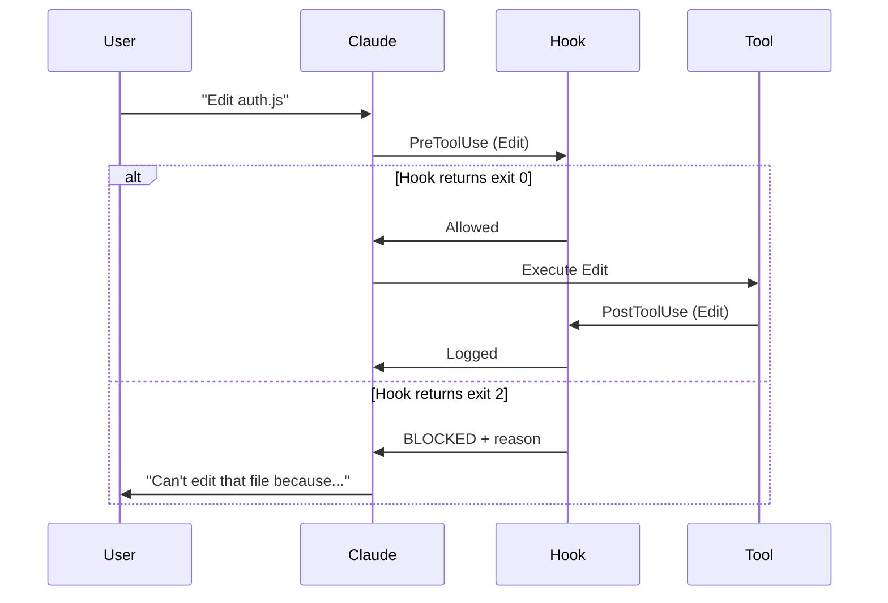

# Hooks

Hooks are shell scripts that run automatically at specific points in Claude Code's lifecycle. They're the enforcement layer — blocking dangerous actions, auditing changes, and injecting context.

## How Hooks Work



## Lifecycle Events

| Event | When | Matcher | Use Case |
|-------|------|---------|----------|
| `SessionStart` | Session begins/resumes | `startup`, `resume`, `compact` | Context re-injection after compaction |
| `UserPromptSubmit` | User sends prompt | — | Detect sensitive prompts, inject context |
| `PreToolUse` | Before tool execution | Tool name: `Bash`, `Edit\|Write` | Block dangerous operations |
| `PostToolUse` | After tool succeeds | Tool name | Audit logging, auto-formatting |
| `Stop` | Claude finishes responding | — | Verification checks, reminders |

??? note "All 16 events"
    `SessionStart`, `UserPromptSubmit`, `PreToolUse`, `PermissionRequest`, `PostToolUse`, `PostToolUseFailure`, `Notification`, `SubagentStart`, `SubagentStop`, `Stop`, `TeammateIdle`, `TaskCompleted`, `ConfigChange`, `PreCompact`, `WorktreeCreate`, `WorktreeRemove`

## Exit Codes

| Code | Behavior |
|------|----------|
| `0` | Allow — stdout becomes context (for SessionStart/UserPromptSubmit) |
| `2` | Block — stderr becomes Claude's feedback |
| Other | Allow — stderr logged in verbose mode |

## Configuration

Hooks are registered in `settings.json` or `settings.local.json`:

```json
{
  "hooks": {
    "PreToolUse": [
      {
        "matcher": "Edit|Write",
        "hooks": [
          {
            "type": "command",
            "command": "bash .claude/hooks/protect-files.sh"
          }
        ]
      }
    ],
    "PostToolUse": [
      {
        "matcher": "Edit|Write",
        "hooks": [
          {
            "type": "command",
            "command": "bash .claude/hooks/audit-edits.sh"
          }
        ]
      }
    ],
    "SessionStart": [
      {
        "matcher": "compact",
        "hooks": [
          {
            "type": "command",
            "command": "bash .claude/hooks/context-reinject.sh"
          }
        ]
      }
    ]
  }
}
```

## Claudin's Included Hooks

### protect-files.sh (PreToolUse)

Blocks edits to sensitive files (`.env`, `.pem`, `.key`, `credentials`, etc.). Allows `.example` and `.template` files.

### audit-edits.sh (PostToolUse)

Logs every file modification with timestamp to `.claude/hooks/audit.log`. Non-blocking.

### context-reinject.sh (SessionStart)

Reminds Claude of critical project context after context window compaction. Customize with your project-specific reminders.

## Hook Types

### Command Hooks (most common)
```json
{ "type": "command", "command": "bash .claude/hooks/my-hook.sh" }
```

### Prompt Hooks (Claude decides)
```json
{ "type": "prompt", "prompt": "Check if all tasks are complete." }
```

### Agent Hooks (Claude with tools)
```json
{ "type": "agent", "prompt": "Verify tests pass.", "timeout": 120 }
```

## Writing Custom Hooks

```bash
#!/bin/bash
# Read JSON input from stdin
INPUT=$(cat)

# Extract tool input with jq
FILE_PATH=$(echo "$INPUT" | jq -r '.tool_input.file_path // empty')

# Your logic here
if [[ "$FILE_PATH" == *".env"* ]]; then
    echo "BLOCKED: Cannot edit .env files" >&2
    exit 2
fi

exit 0
```

!!! warning "Always read from stdin"
    Hook input is provided via stdin as JSON, not as arguments. Use `INPUT=$(cat)` to capture it.
