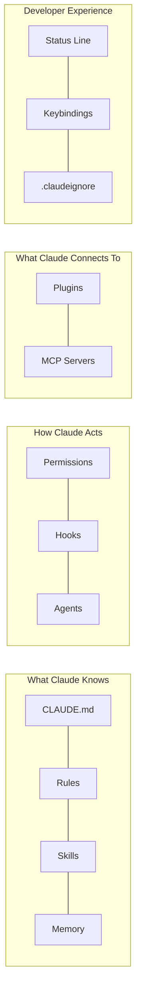

# Features

Claude Code has a rich extensibility system. Each feature serves a specific purpose in your development workflow.

## Feature Map

## Feature Reference

| Feature | Location | Loaded | Purpose |
|---------|----------|--------|---------|
| [CLAUDE.md](claude-md.md) | Project root | Every session | Project instructions and conventions |
| [Rules](rules.md) | `.claude/rules/` | Auto (by glob) | File-specific coding standards |
| [Skills](skills.md) | `.claude/skills/` | Auto or `/skill` | Reusable capabilities and workflows |
| [Hooks](hooks.md) | `.claude/hooks/` | On lifecycle events | Automation and enforcement |
| [Agents](agents.md) | `.claude/agents/` | On delegation | Isolated subagents for specific tasks |
| [Plugins](plugins.md) | Marketplace | On install | Bundles of skills, agents, hooks, MCPs |
| [MCP Servers](mcp-servers.md) | `.mcp.json` | On session start | External tool integrations |
| [Permissions](permissions.md) | `settings.json` | Always | Allow/deny rules for tools |
| [Status Line](status-line.md) | `~/.claude/` | Always | Terminal status bar |
| [Keybindings](keybindings.md) | `~/.claude/` | Always (CLI) | Keyboard shortcuts |
| [.claudeignore](claudeignore.md) | Project root | Always | Context window optimization |
| [Memory](memory.md) | `~/.claude/projects/` | Always | Persistent knowledge across sessions |
| [Agent Teams](agent-teams.md) | Runtime | On demand | Multi-agent orchestration |

## Settings Hierarchy

Settings are loaded in order of precedence (highest to lowest):

1. **Managed settings** — enterprise-deployed, cannot override
2. **Command-line arguments** — `claude --model opus`
3. **Local settings** — `.claude/settings.local.json` (personal, gitignored)
4. **Project settings** — `.claude/settings.json` (shared via git)
5. **User settings** — `~/.claude/settings.json` (global)
