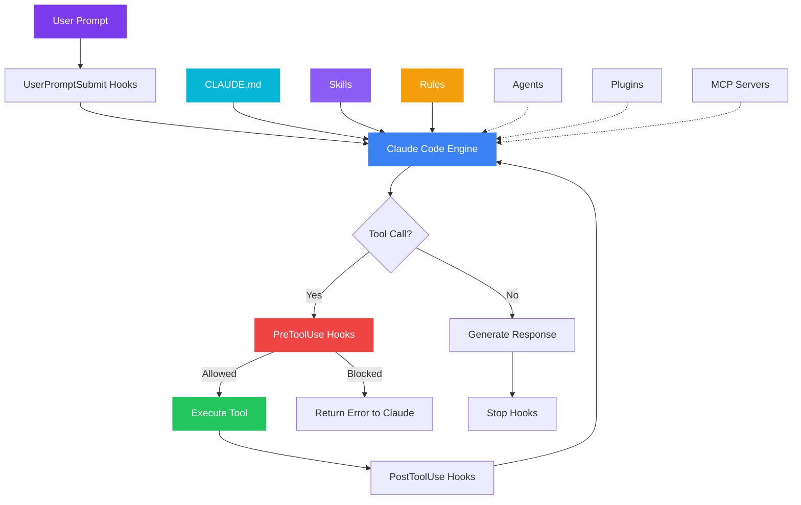

<div class="cl-hero" markdown>

# Claudin

**The ultimate Claude Code environment boilerplate — from zero to productive in minutes.**

Drop a production-ready `.claude/` scaffold into any project. Security, cost optimization, and team conventions — all pre-configured.

<div class="cl-buttons">
<a href="getting-started/installation/" class="md-button md-button--primary">
  🚀 Get Started
</a>
<a href="https://github.com/acn3to/claudin" class="md-button">
  GitHub
</a>
</div>

</div>

<div class="cl-stats" markdown>

<div class="cl-stat">
  <span class="cl-stat-value">5</span>
  <span class="cl-stat-label">Project Profiles</span>
</div>

<div class="cl-stat">
  <span class="cl-stat-value">3</span>
  <span class="cl-stat-label">Custom Agents</span>
</div>

<div class="cl-stat">
  <span class="cl-stat-value">60+</span>
  <span class="cl-stat-label">Ignore Patterns</span>
</div>

<div class="cl-stat">
  <span class="cl-stat-value">14</span>
  <span class="cl-stat-label">Feature Docs</span>
</div>

</div>

---

## Why Claudin?

Setting up Claude Code for a new project means configuring **skills, hooks, agents, rules, permissions, plugins, MCP servers, status line, keybindings, CI/CD**, and more. Each feature has its own syntax, location, and best practices.

**Claudin gives you everything in one command.**

```bash
git clone https://github.com/acn3to/claudin.git
cd claudin && bash scripts/setup.sh /path/to/your-project
```

---

## Features

<div class="cl-features" markdown>

<div class="cl-feature" markdown>
<span class="cl-feature-icon">:material-shield-lock:</span>

### Security by Default

Hooks that block secret exposure, audit every file change, and protect credentials. Deny rules prevent `git push --force` and `rm -rf /`.
</div>

<div class="cl-feature" markdown>
<span class="cl-feature-icon">:material-currency-usd:</span>

### Cost Optimization

Smart model selection — Sonnet for daily work (60% savings), Haiku for subagents (85-92% savings). Real-time cost tracking.
</div>

<div class="cl-feature" markdown>
<span class="cl-feature-icon">:material-robot:</span>

### Custom Agents

Pre-built **code reviewer**, **documenter**, and **architecture reviewer** agents with scoped permissions and focused capabilities.
</div>

<div class="cl-feature" markdown>
<span class="cl-feature-icon">:material-puzzle:</span>

### Skills & Plugins

Starter skill with proper frontmatter, clean architecture refactoring skill, and a plugin system for bundled capabilities.
</div>

<div class="cl-feature" markdown>
<span class="cl-feature-icon">:material-lightning-bolt:</span>

### Context Optimization

`.claudeignore` template excluding 60+ file patterns, saving 30k-100k tokens per session. Context re-injection preserves critical info.
</div>

<div class="cl-feature" markdown>
<span class="cl-feature-icon">:material-github:</span>

### CI/CD Ready

GitHub Actions workflow with `claude-code-action` for automated PR reviews, headless mode for pipelines, and Agent SDK integration.
</div>

</div>

---

## What's Included

| Component | What You Get |
|:----------|:-------------|
| [:material-file-document: **CLAUDE.md**](features/claude-md.md) | Customizable project instructions template |
| [:material-puzzle: **Skills**](features/skills.md) | Starter skill + clean architecture refactoring |
| [:material-hook: **Hooks**](features/hooks.md) | File protection, audit logging, context re-injection |
| [:material-robot: **Agents**](features/agents.md) | Code reviewer, documenter, architecture reviewer |
| [:material-book-open-variant: **Rules**](features/rules.md) | Code standards and clean architecture patterns |
| [:material-shield-check: **Permissions**](features/permissions.md) | Safe allow/deny defaults |
| [:material-power-plug: **Plugins**](features/plugins.md) | Recommended plugins per stack |
| [:material-server: **MCP Servers**](features/mcp-servers.md) | Context7 and other useful servers |
| [:material-chart-bar: **Status Line**](features/status-line.md) | Model, git, context bar, cost, duration |
| [:material-keyboard: **Keybindings**](features/keybindings.md) | Productive keyboard shortcuts |
| [:material-file-hidden: **Claudeignore**](features/claudeignore.md) | 60+ universal file exclusions |
| [:material-github: **CI/CD**](ci-cd/github-actions.md) | GitHub Actions with claude-code-action |
| [:material-microsoft-visual-studio-code: **VS Code**](ide-integration/vscode.md) | Extension setup and CLI coexistence |

---

## Architecture



---

## Project Profiles

Choose a profile that matches your stack. Each extends the base template with stack-specific configurations.

=== ":material-nodejs: Node.js API"

    **Stack:** Express/Fastify + MongoDB/PostgreSQL

    REST patterns, test runner config, async error handling rules.

    ```bash
    bash scripts/setup.sh /path/to/project  # Select "node-api"
    ```

=== ":material-language-python: Python"

    **Stack:** Flask/FastAPI + SQLAlchemy

    Linting standards, docstring conventions, venv handling hooks.

    ```bash
    bash scripts/setup.sh /path/to/project  # Select "python"
    ```

=== ":material-folder-multiple: Monorepo"

    **Stack:** Multi-service TypeScript

    Service-scoped rules, workspace navigation, cross-service review agent.

    ```bash
    bash scripts/setup.sh /path/to/project  # Select "monorepo"
    ```

=== ":material-react: React Frontend"

    **Stack:** React + TypeScript

    Component patterns, accessibility checks, state management rules.

    ```bash
    bash scripts/setup.sh /path/to/project  # Select "frontend-react"
    ```

=== ":material-aws: Serverless"

    **Stack:** AWS Lambda + DynamoDB

    Handler patterns, cold start awareness, IaC validation hooks.

    ```bash
    bash scripts/setup.sh /path/to/project  # Select "serverless"
    ```

---

<div class="cl-stats" markdown>

<div class="cl-stat">
  <span class="cl-stat-value">3</span>
  <span class="cl-stat-label">Security Hooks</span>
</div>

<div class="cl-stat">
  <span class="cl-stat-value">2</span>
  <span class="cl-stat-label">Architecture Rules</span>
</div>

<div class="cl-stat">
  <span class="cl-stat-value">5</span>
  <span class="cl-stat-label">Stack Profiles</span>
</div>

<div class="cl-stat">
  <span class="cl-stat-value">30+</span>
  <span class="cl-stat-label">Doc Pages</span>
</div>

</div>

!!! tip "Ready to get started?"
    Head to the [Installation Guide](getting-started/installation.md) to set up Claudin in your project in under 5 minutes.
