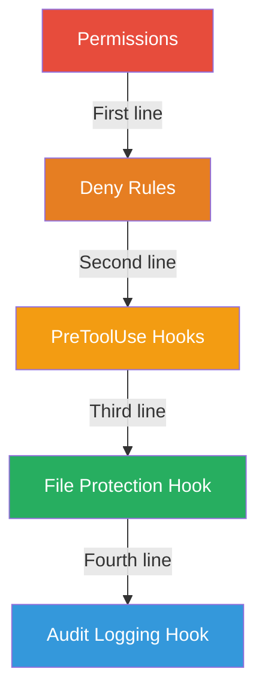

# Security

Claudin takes a defense-in-depth approach to security with multiple layers of protection.

## Security Layers

1. **[Permissions](../features/permissions.md)** — deny dangerous commands outright
2. **[Hooks](hook-patterns.md)** — block sensitive file access, audit changes
3. **[.claudeignore](../features/claudeignore.md)** — prevent reading sensitive files
4. **[Rules](../features/rules.md)** — enforce security coding standards

## Quick Checklist

- [ ] `.env`, `.pem`, `.key` files are protected by hooks
- [ ] `git push --force` is denied in permissions
- [ ] `rm -rf /` is denied in permissions
- [ ] Audit logging is enabled for file edits
- [ ] CLAUDE.md has security rules section
- [ ] No credentials in version control
